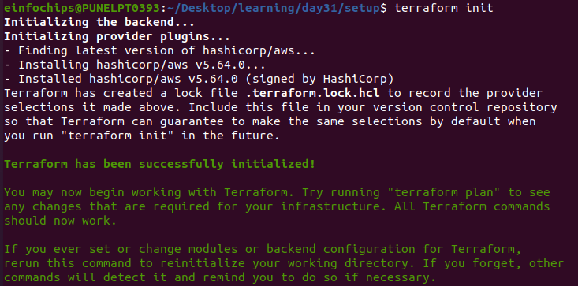

# Automation (IaaC) Terraform on AWS Assessment Project

## Project Overview
This capstone project demonstrates the deployment of a complete multi-tier architecture on AWS using Terraform. The project focuses on essential concepts such as state locking, variables, .tfvars files, reusable modules, functions, workspaces, and lifecycle rules. The infrastructure leverages AWS Free Tier resources to minimize costs.

## Project Objectives
The key objectives of this project are:
- Deploy a multi-tier architecture using Terraform on AWS.
- Implement Terraform state locking for managing concurrent changes.
- Use variables and .tfvars files to parameterize the deployment.
- Create and use Terraform modules for better organization and reusability.
- Utilize functions for dynamic resource configuration.
- Manage multiple environments (dev, staging, prod) with Terraform workspaces.
- Implement lifecycle rules to control resource creation, updates, and deletion.

## Infrastructure Design
This project will deploy a basic 3-tier web application architecture consisting of:

1. **VPC**: A VPC with public and private subnets across two availability zones.
2. **Security Groups**: Security groups to control inbound and outbound traffic.
3. **EC2 Instances**: Web server instances deployed in the public subnets (Application Tier).
4. **RDS Instance**: MySQL database deployed in a private subnet (Database Tier).
5. **S3 Bucket**: A versioned S3 bucket for storing static files.
6. **Elastic IPs**: Elastic IPs assigned to EC2 instances.
7. **IAM Roles**: IAM roles for EC2 instances with appropriate permissions.

## Project Requirements
### 1. Terraform State Management
- **Remote State Storage**: Terraform state file stored in an S3 bucket.
- **State Locking**: DynamoDB table to manage state locking and prevent concurrent modifications.

### 2. Variables and tfvars Files
- **Variables**: Input variables for VPC CIDR, instance types, RDS credentials, S3 bucket names, etc.
- **tfvars Files**: Use `.tfvars` files for different configurations per environment (e.g., `dev.tfvars`, `prod.tfvars`).

### 3. Modules
- **VPC Module**: Configures VPC, subnets, and route tables.
- **EC2 Module**: Provisions EC2 instances with appropriate configurations.
- **RDS Module**: Sets up the RDS MySQL instance.
- **S3 Module**: Manages S3 buckets with versioning enabled.
- **IAM Module**: Configures IAM roles and policies.

### 4. Functions
- Use Terraform functions to:
  - **Name Resources**: Using `format` and `join` functions.
  - **Configure Subnet CIDRs**: Using the `cidrsubnet` function.
  - **Lookup AMI IDs**: Using the `lookup` function.

### 5. Workspaces
- Create separate Terraform workspaces for different environments: `development`, `staging`, and `production`.
- Deploy infrastructure in each environment using the appropriate workspace and `.tfvars` file.

### 6. Lifecycle Rules
- **prevent_destroy**: Prevent accidental deletion of critical resources like the RDS database.
- **ignore_changes**: Ignore changes to certain resource attributes (e.g., S3 bucket tags).

## Project Steps

### Step 1: Setup Remote State and Locking
- Create an S3 bucket to store the Terraform state file.

```
resource "aws_s3_bucket" "terraform_state" {
  bucket = var.bucket_state_name  # Replace with a unique bucket name

  tags = {
    Name = var.bucket_state_name
  }
}

# Enable versioning for the S3 bucket
resource "aws_s3_bucket_versioning" "s3_versioning" {
  bucket = aws_s3_bucket.terraform_state.id
  versioning_configuration {
    status = "Enabled"
  }
}

variable "bucket_state_name" {
  description = "S3 bucket name which is used for state files"
  type = string
}

output "s3_bucket_name" {
  description = "Output of s3 bucket which is used for state files"
  value = aws_s3_bucket.terraform_state.bucket
}
```
- Create a DynamoDB table for state locking.

```
# DynamoDB table for state locking
resource "aws_dynamodb_table" "terraform_lock" {
  name         = var.dynamoDB_table_name
  hash_key      = "LockID"
  billing_mode  = "PAY_PER_REQUEST"

  attribute {
    name = "LockID"
    type = "S"
  }

  tags = {
    Name = "DynamoDb-shreya"
  }
}

variable "dynamoDB_table_name" {
  description = "variable for dynamoDB table name"
  type = string
}

output "dynamoDB_table_name" {
  description = "Output of s3 bucket which is used for state files"
  value = aws_dynamodb_table.terraform_lock.name
}
```
- Configure the Terraform backend to use the S3 bucket and DynamoDB table.

```
# backend.tf
terraform {
  backend "s3" {
    bucket         = "shreya-state-bucket"
    key            = "terraform.tfstate"
    region         = "us-east-1"
    dynamodb_table = "terraform-locks-shreya"
  }
}
```
`terraform init`

<br>




`terraform plan`

<br>


<br>


`terraform apply`

<br>


<br>


### Step 2: Develop and Organize Modules
- Break down the infrastructure into modules: VPC, EC2, RDS, S3, and IAM.

<br>


- Place each module in its own directory with `main.tf`, `variables.tf`, and `outputs.tf`.

### Step 3: Define Variables and tfvars Files
- Define input variables in `variables.tf` files within each module.

 - [ec2 modules variables](day31/modules/ec2/variables.tf)
 - [IAM_Role modules variables](day31/modules/IAM_Role/variables.tf)
 - [RDS modules variables](day31/modules/RDS/variables.tf)
 - [s3 modules variables](day31/modules/s3/variables.tf)
 - [security_group modules variables](day31/modules/security_group/variables.tf)
 - [vpc modules variables](day31/modules/vpc/variables.tf)

- Create default `.tfvars` files 
```
ami            = "ami-0522ab6e1ddcc7055"
instance_type  = "t2.micro"
instance_name  = "Webserver-shreya"
bucket_name    = "day31-shreya"
key_pair       = "terraform-shreya-key"
ec2_iam_role_arn = "arn:aws:iam::021891610828:role/EC2-S3-Role" 
vpc_cidr_ip = "10.0.0.0/16"
pub_subnet_cidr_ip = "10.0.1.0/24"
private_subnet1_cidr = "10.0.2.0/24"
private_subnet2_cidr = "10.0.3.0/24"
db_name = "mydb"
db_username = "admin"
db_password = "user"
```

- create environment-specific files (e.g., `dev.tfvars`, `prod.tfvars`).

<br>


### Step 4: Implement Workspaces
- Initialize Terraform 
- `terraform init`

<br>


- create workspaces for `development`,  and `production`.
<br>


<br>


- Deploy the infrastructure in each workspace using the corresponding `.tfvars` file.

### Step 5: Deploy the Infrastructure
- Run `terraform plan `& `terraform apply` to deploy the infrastructure in each workspace.

- `dev` : `terraform plan -var-file="workspace/dev/dev.tfvars"`

<br>


- `prod` : `terraform plan -var-file="workspace/prod/prod.tfvars"`

<br>


- Verify the deployment by accessing the EC2 instances and ensuring the application is functioning.

<br>


<br>


### Step 6: Implement Lifecycle Rules
- Add lifecycle rules to critical resources such as RDS to prevent accidental deletion.
- Apply the changes and ensure that the lifecycle rules are enforced.

### Step 7: Cleanup
- Destroy the infrastructure in each workspace using `terraform destroy`.
- Ensure resources with `prevent_destroy` are not deleted.

## Deliverables
1. **Terraform Configuration Files**:
   - `main.tf`, `variables.tf`, `outputs.tf`, `.tfvars`, and module files.
2. **Written Report**:
   - Explanation of the infrastructure design and the use of Terraform features like state locking, workspaces, modules, and lifecycle rules.
   - Discuss challenges faced during the project.
3. **Screenshots or Logs**:
   - Evidence of successful deployment, state locking, workspace usage, and lifecycle rule implementation.

## Conclusion
This project is an assessment of your ability to deploy infrastructure on AWS using Terraform, following best practices in modularization, state management, workspace management, and lifecycle rule configuration. The project helps solidify your skills in infrastructure as code (IaaC) with Terraform on AWS.
