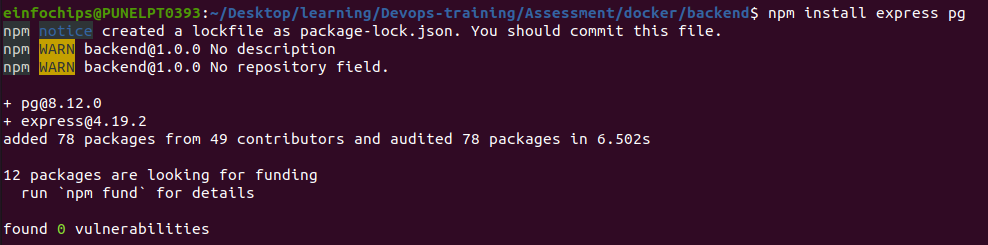
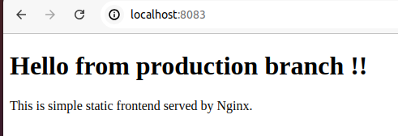

# Assessment: Use Case Oriented Project

## Project Overview
You are tasked with setting up a CI/CD pipeline for a microservices-based application. The
application will be containerized using Docker and orchestrated using Kubernetes. Ansible
will be used for configuration management and deployment. The entire setup should be
managed using Git for version control, and Jenkins will be used to automate the CI/CD
process.

### Assessment Criteria
1. Git:
+ Repository setup
 +  Branching strategies
 + Commit and merge practices

2. Jenkins:
 + Pipeline creation using Jenkinsfile
 + Integration with Git
 + Automated build, test, and deployment stages

3. Docker:
 + Dockerfile creation
 + Image building and management
 + Containerization of microservices

4. Kubernetes:
 + Pod and service creation
 + Deployments and replica sets
 + ConfigMaps and Secrets

5. Ansible:
 + Playbook creation
 + Use of variables and templates
 + Inventory management


### Use Case Scenario

Your company is developing a new e-commerce application consisting of several
microservices: a front-end service, a product catalog service, and an order processing
service. The goal is to automate the deployment and configuration of these services across
development, testing, and production environments using Ansible, Docker, Kubernetes, and
Jenkins.

### Tasks and Deliverables

#### Task 1: Git Repository Setup
1. **Create a Git repository** to store all project files, including Ansible playbooks,
Dockerfiles, and Kubernetes manifests.

+ initialize git repo using command : 
```
git init
```

+ check status using command :
```
git status
```

+ add and commit changes:
```
git add .
git commit -m "initial changes done"
```

+ add remote repo using command :
```
git remote add origin https://github.com/Shreyad01/Assessment2Aug.git
```

+ again check status
```
git status
```
+ push the changes on github 
```
git push -u origin master
```
2. **Branching Strategy:**
 + Create branches for development, testing, and production. using following command

 ```
 git branch development
 git branch testing
 git branch production
 
 ```

 <br>

 
 
 +  Implement a strategy for merging changes from development to testing and
production.

#### Task 2: Dockerize Microservices

1. First we create frontend , backend, and database directory on **development branch**
```
mkdir frontend backend databse
```

2. create shared network and volume 
 `sudo docker network create fullstack-network `

 <br>

 

 `sudo docker volume create pgdata`

 <br>

  

3. Create Dockerfiles for each microservice (front-end, product catalog, order
processing).

 +  in frontend folder create **index.html** and **dockerfile** for front-end on development branch
    
     <br>

  
  
  <br>

  

4. Build Docker images for each microservice and push them to a container registry
(e.g., Docker Hub).

5. Deliverables:

+ Dockerfiles for each microservice

 

 

 

 2. in backend folder create **index.js** and **docekrfile** on development branch.
   + for this first we initialize the Node.js application by using command :

    `npm init -y`
    
  <br>

  

   + Now we will install PostgresSql client for Node.js by using command :

   ` npm install express pg`

   <br>

   

  <br>

   

   <br>

 
  
  3. in database create **dockerfile** on development branch

  <br>

 


+ Built Docker images in a container registry

 1. build the image of **front-end** in **development branch** using command 
   `sudo docker build -t frontend . `

   <br>

   


  2. Build the **database** in **development branch** using command :

  ` sudo docker build -t my-postgres-db .`

  <br>

   
  
  3. Build the **backend** in **development branch** using command :

  ` sudo docker build -t backend .` 

  <br>

   


+ Push the Docker image to Docker Hub 

 login dockerhub `docker login -u dockerHUb_username`

 
  <br>

  

  + Create image tag for frontend and backend image 

   + for frontend :
     `docker tag frontend:latest your-dockerhub-username/assesment:frontend`

  + now push the image on dockerhub using command :

  + for frontend:

   ` sudo docker push dockerHUb_username/dockerhub_reponame:image_tag`
   <br>

   

   + for backend :

   `sudo docker push dockerhub_username/dockerhub_reponame:image_tag`


#### Task 3: Kubernetes Deployment

+ First start `minikube`

+  Write a Kubernetes  frontend-deployment and backend - deployment

   <br>
  
+ Apply kubectl

 `kubectl apply -f frontend-deployment.yaml`
   
   <br>

  

  `kubectl apply -f backend-deployment.yaml`

  <br>

  

   `kubectl apply -f backend-config.yaml`

   <br>

   

   `kubectl apply -f backend-service.yaml`

   <br>

   

   `kubectl apply -f database-deployment.yaml`

   <br>

   

   `kubectl apply -f database-pvc.yaml`

   <br>

   

   `kubectl apply -f database-service.yaml`

   <br>

   

   `kubectl apply -f frontend-service.yaml`

   <br>

   

2. Deploy the microservices to a Kubernetes cluster.

3. Deliverables:
+ Kubernetes manifests (YAML files)
+ Successful deployment of microservices in the Kubernetes cluster

### 3. on browser run  command `localhost:8082 ` to see output  of **development** branch.

 <br>

 

 4. on browser run  command `localhost:8083 ` to see output  of **production** branch.

 <br>

 

 5. on browser run  command `localhost:8084 ` to see output  of **testing** branch.
 
  <br>

  

#### do same above process for testing and production branch


