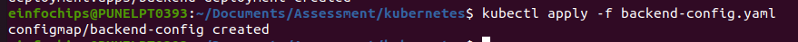

# Assessment: Use Case Oriented Project

## Project Overview
You are tasked with setting up a CI/CD pipeline for a microservices-based application. The
application will be containerized using Docker and orchestrated using Kubernetes. Ansible
will be used for configuration management and deployment. The entire setup should be
managed using Git for version control, and Jenkins will be used to automate the CI/CD
process.

### Assessment Criteria
1. Git:
+ Repository setup
 +  Branching strategies
 + Commit and merge practices

2. Jenkins:
 + Pipeline creation using Jenkinsfile
 + Integration with Git
 + Automated build, test, and deployment stages

3. Docker:
 + Dockerfile creation
 + Image building and management
 + Containerization of microservices

4. Kubernetes:
 + Pod and service creation
 + Deployments and replica sets
 + ConfigMaps and Secrets

5. Ansible:
 + Playbook creation
 + Use of variables and templates
 + Inventory management


### Use Case Scenario

Your company is developing a new e-commerce application consisting of several
microservices: a front-end service, a product catalog service, and an order processing
service. The goal is to automate the deployment and configuration of these services across
development, testing, and production environments using Ansible, Docker, Kubernetes, and
Jenkins.

### Tasks and Deliverables

#### Task 1: Git Repository Setup
1. **Create a Git repository** to store all project files, including Ansible playbooks,
Dockerfiles, and Kubernetes manifests.

+ initialize git repo using command : 
```
git init
```

+ check status using command :
```
git status
```

+ add and commit changes:
```
git add .
git commit -m "initial changes done"
```

+ add remote repo using command :
```
git remote add origin https://github.com/Shreyad01/Assessment2Aug.git
```

+ again check status
```
git status
```
+ push the changes on github 
```
git push -u origin master
```
2. **Branching Strategy:**
 + Create branches for development, testing, and production. using following command

 ```
 git branch development
 git branch testing
 git branch production
 
 ```

 <br>

 
 
 +  Implement a strategy for merging changes from development to testing and
production.

#### Task 2: Dockerize Microservices

1. First we create frontend , backend, and database directory on **development branch**
```
mkdir frontend backend databse
```

2. create shared network and volume 
 `sudo docker network create fullstack-network `

 <br>

 

 `sudo docker volume create pgdata`

 <br>

  

3. Create Dockerfiles for each microservice (front-end, product catalog, order
processing).

 +  in frontend folder create **index.html** and **dockerfile** for front-end on development branch
    
     <br>

  
  
  <br>

  

+ in database create **dockerfile** on development branch for **product catlog**

  <br>

 

+ in backend folder create **index.js** and **dockerfile** on development branch for **order processing** 

 <br>

 

<br>

   


4. Build Docker images for each microservice and push them to a container registry
(e.g., Docker Hub).

+ build the image of **front-end** in **development branch** using command : 
  
  `sudo docker build -t frontend . `

  <br>

   


+ Build the **database** in **development branch** using command :

  ` sudo docker build -t my-postgres-db .`

 <br>

   

+ Build the **backend** in **development branch** using command :

  ` sudo docker build -t backend .` 

  <br>

   


5. Deliverables:

+ Dockerfiles for each microservice

+ Built Docker images in a container registry

  


+ TO push the Docker image to Docker Hub 

 login dockerhub  :

`docker login -u dockerHub_username`
 
  <br>

  

+ Create image tag for frontend , backend  and database image 

   + for frontend :
     
  `docker tag frontend:latest shreyad01/assesment:frontend`
   
   +  for backend :

  `docker tag backend:latest shreyad01/assesment:backend`

   +  for database :

  `docker tag my-postgres-db:latest shreyad01/assesment:my-postgres-db` 

  + now push the image on dockerhub using command :

  + for frontend:

   ` sudo docker push shreyad01/assesment:frontend`
   <br>

   

   + for backend :

   `sudo docker push shreyad01/assesment:backend`

   + for database : 

   `sudo docker push shreyad01/assesment:my-postgres-db`

   <br>

   


#### Task 3: Kubernetes Deployment

+ First start `minikube`

1. Create **Kubernetes manifests for deploying each microservice**.
   + Define Pods, Services, Deployments, and ReplicaSets.
   + Use ConfigMaps and Secrets for configuration management.

 **frontend-deployment.yaml**

  ```
apiVersion: apps/v1
kind: Deployment
metadata:
  name: frontend-deployment
spec:
  replicas: 1
  selector:
    matchLabels:
      app: frontend
  template:
    metadata:
      labels:
        app: frontend
    spec:
      containers:
      - name: frontend
        image: chirag1212/full-stack-app:frontend_v3
        ports:
        - containerPort: 80

  ```

  **frontend-service.yaml**

  ```
  apiVersion: v1
kind: Service
metadata:
  name: frontend-service
spec:
  selector:
    app: frontend
  ports:
    - protocol: TCP
      port: 80
      targetPort: 80
      nodePort: 30006
  type: NodePort

  ```

**backend-deployment.yaml**

```
apiVersion: apps/v1
kind: Deployment
metadata:
  name: backend-deployment
spec:
  replicas: 1
  selector:
    matchLabels:
      app: backend
  template:
    metadata:
      labels:
        app: backend
    spec:
      containers:
      - name: backend
        image: chirag1212/full-stack-app:backend
        ports:
        - containerPort: 3000
        env:
        - name: DATABASE_HOST
          valueFrom:
            configMapKeyRef:
              name: backend-config
              key: DATABASE_HOST
        - name: DATABASE_PORT
          valueFrom:
            configMapKeyRef:
              name: backend-config
              key: DATABASE_PORT
        - name: DATABASE_USER
          valueFrom:
            configMapKeyRef:
              name: backend-config
              key: DATABASE_USER
        - name: DATABASE_PASSWORD
          valueFrom:
            configMapKeyRef:
              name: backend-config
              key: DATABASE_PASSWORD
        - name: DATABASE_NAME
          valueFrom:
            configMapKeyRef:
              name: backend-config
              key: DATABASE_NAME
```

**backend-service.yaml**

```
apiVersion: v1
kind: Service
metadata:
  name: backend-service
spec:
  selector:
    app: backend
  ports:
    - protocol: TCP
      port: 3000
      targetPort: 3000
  type: ClusterIP
```

**backend-config.yaml**

```
apiVersion: v1
kind: ConfigMap
metadata:
  name: backend-config
data:
  DATABASE_HOST: postgresql-service
  DATABASE_PORT: "5432"
  DATABASE_USER: appUser
  DATABASE_PASSWORD: user@123
  DATABASE_NAME: mydatabase
```

**database-deployment.yaml**

```
apiVersion: apps/v1
kind: Deployment
metadata:
  name: postgresql-deployment
spec:
  replicas: 1
  selector:
    matchLabels:
      app: postgresql
  template:
    metadata:
      labels:
        app: postgresql
    spec:
      containers:
      - name: postgresql
        image: chirag1212/full-stack-app:database
        ports:
        - containerPort: 5432
        env:
        - name: POSTGRES_USER
          value: "appUser"
        - name: POSTGRES_PASSWORD
          value: "user@123"
        - name: POSTGRES_DB
          value: "mydatabase"
        volumeMounts:
        - name: postgredb-storage
          mountPath: /var/lib/postgresql/data
      volumes:
      - name: postgredb-storage
        persistentVolumeClaim:
          claimName: postgresql-pvc
```

**database-service.yaml**

```
apiVersion: v1
kind: Service
metadata:
  name: postgresql-service
spec:
  selector:
    app: postgresql
  ports:
    - protocol: TCP
      port: 5432
      targetPort: 5432
  type: ClusterIP
```

**database-pvc.yaml**

```
apiVersion: v1
kind: PersistentVolumeClaim
metadata:
  name: postgresql-pvc
spec:
  accessModes:
    - ReadWriteOnce
  resources:
    requests:
      storage: 1Gi
```

2. **Deploy the microservices to a Kubernetes cluster.**

 `kubectl apply -f frontend-deployment.yaml`
   
   <br>

  

  `kubectl apply -f backend-deployment.yaml`

  <br>

  

   `kubectl apply -f backend-config.yaml`

   <br>

   

   `kubectl apply -f backend-service.yaml`

   <br>

   

   `kubectl apply -f database-deployment.yaml`

   <br>

   

   `kubectl apply -f database-pvc.yaml`

   <br>

   

   `kubectl apply -f database-service.yaml`

   <br>

   

   `kubectl apply -f frontend-service.yaml`

   <br>

  


3. Deliverables:
+ Kubernetes manifests (YAML files)
+ Successful deployment of microservices in the Kubernetes cluster


#### Task 4: Ansible Configuration Management

1. Create Ansible playbooks to manage the deployment and configuration of the
microservices.
  + Use variables to handle environment-specific configurations.
  + Utilize Jinja2 templates to dynamically generate configuration files.

2. Set up Ansible inventories to manage different environments (development,
testing, production).

3. Deliverables:
 + Ansible playbooks
 + Ansible inventory files
 + Jinja2 templates for configuration files


#### Task 5: Jenkins CI/CD Pipeline
1. Set up a Jenkins pipeline using a Jenkinsfile.
 + Integrate with Git to trigger the pipeline on code changes.
 + Define stages for building Docker images, pushing them to the registry,
deploying to Kubernetes, and running tests.

2. Implement error handling and notifications to alert the team on failures.

3. Deliverables:
 + Jenkinsfile defining the CI/CD pipeline
+ Screenshots or logs demonstrating successful pipeline execution


### Evaluation Criteria
Participants will be evaluated based on the following:
1. Git:
 + Proper repository setup with clear structure and documentation
 + Effective branching strategy and merge practices

2. Docker:
 + Correct and efficient Dockerfile creation
 + Successful building and pushing of Docker images

3. Kubernetes:
 + Accurate and functional Kubernetes manifests
 + Successful deployment and management of microservices in the cluster

4. Ansible:
 + Well-structured playbooks with proper use of variables and templates
 + Effective inventory management for different environments

5. Jenkins:
 + Comprehensive and functional Jenkins pipeline
 + Proper integration with Git and handling of build, test, and deployment stages
 + Effective error handling and notifications


### Submission
Participants should submit the following:

+ Git repository URL with all project files
+ Docker Hub repository links to the built images
+ Screenshots or logs of the Kubernetes deployment
+ Jenkins pipeline execution logs or screenshots
+ Detailed documentation explaining the setup and configurations


